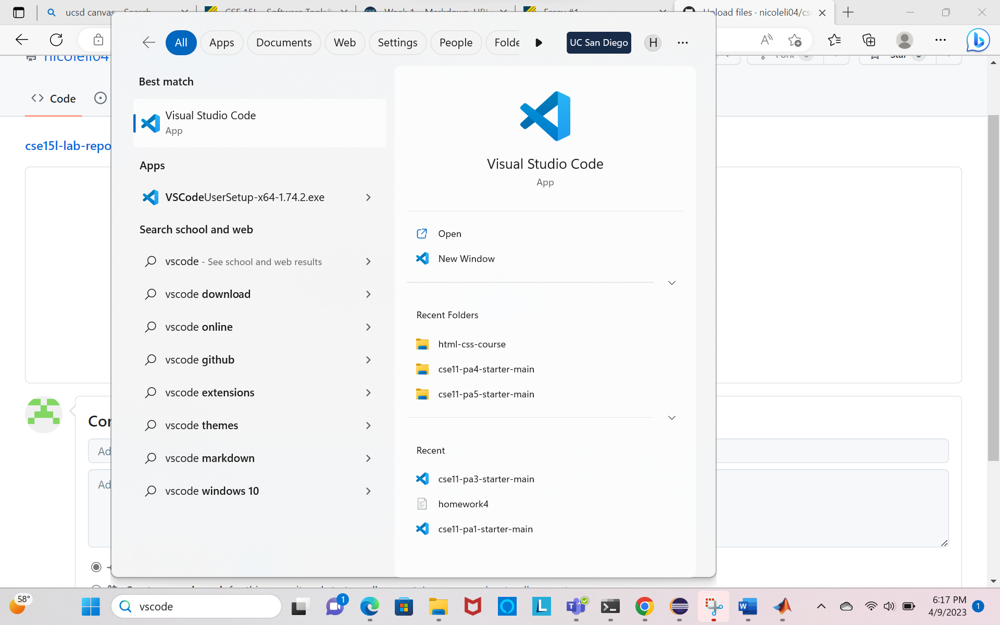
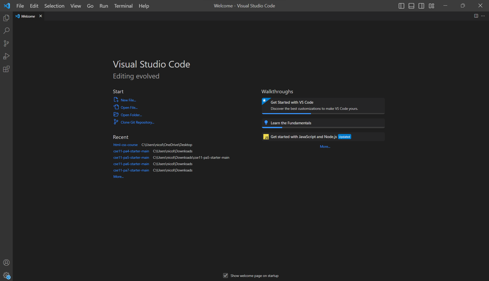
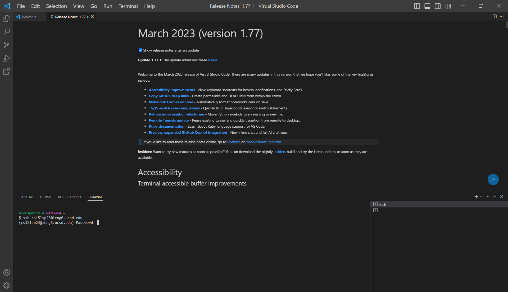
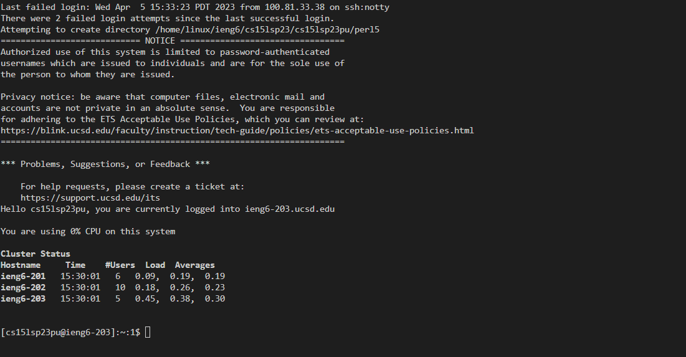
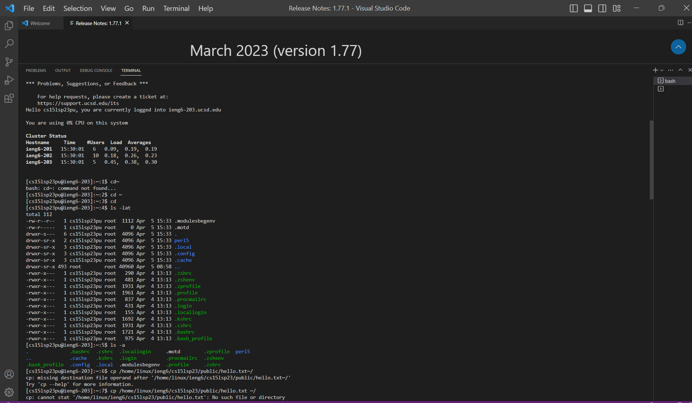
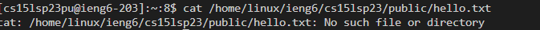
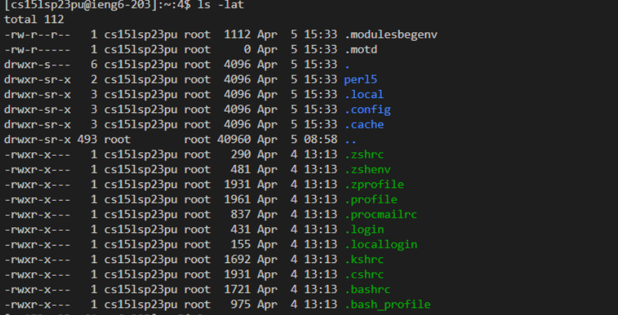
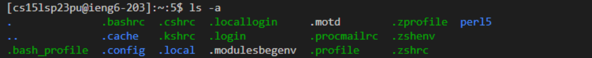
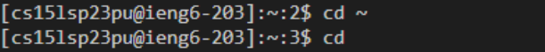

Lab Report 1
============
This is a tutorial showing how to log into a course-specific account on ieng6

**Installing/Accessing VScode**
---

> Since my computer already had VScode installed from taking CSE8B last quarter, I did not need to install VScode. But you are probably not as fortunate as I am, so I will explain how to install VScode.

1) Go to this [link](https://code.visualstudio.com/) and install **Visual Studio Code** onto your computer following the instructions. Make sure to download the specific version based on whatever your operating system is. My operating system is Windows so I would download the version of VScode specific to Windows. 

> This is if you have downloaded VScode and how you can access VScode from your laptop.

2) Find VScode on your laptop using the search bar from your laptop

3) Open VScode by clicking the open button

4) You should end up with something like this when VScode is opened:

Congratulations! You successfully installed and accessed VScode!

**Remotely Connecting**
---
1) Install Git

> I already have Git installed. But since this is a tutorial for beginners sadly I tell you how to install Git. 

2) Open a terminal on VScode (make sure it uses git bash) and type in `ssh [your usename]@ieng6.ucsd.edu`, your username should be from your course specific account and it should be in the form of cs15lsp23zz. Please make sure you don't put zz in, zz represents your specific letters. For example, my username is cs15lsp23pv.

3) You will receive a message like this: 
`⤇ ssh cs15lwi23zz@ieng6.ucsd.edu
The authenticity of host 'ieng6.ucsd.edu (128.54.70.227)' can't be established.
RSA key fingerprint is SHA256:ksruYwhnYH+sySHnHAtLUHngrPEyZTDl/1x99wUQcec.
Are you sure you want to continue connecting (yes/no/[fingerprint])? `

respond `yes`. 
Don't worry no harm will be done by pressing yes

4) Enter your password 
> note that the terminal will not show you typing anything while you are entering in the password. When I was trying to enter my password in I thought I wasn't typing anything because nothing showed up on the terminal so I had to re-enter my password many times, you can probably see from the next screenshot that has all my failed login requests.

5) You should have something like this:

Congratulations! Your terminal is now connected to a computer in the CSE basement!

**Trying Some Commands**
---
1) Try running some of these commands on the terminal
> `cd ~`
`cd`
`ls -lat`
`ls -a`
`ls /home/linux/ieng6/cs15lsp23/cs15lsp23zz`
`cp /home/linux/ieng6/cs15lsp23/public/hello.txt ~/`
`cat /home/linux/ieng6/cs15lsp23/public/hello.txt`

2) Here are some commands that I tried out and some of the outputs produced.

3) Think about what the commands do. This is the perfect time to review what you learned from the lectures. This was really helpful for me because I realized that I actually didn't remember what any of the commands do. But now I do! And I will explain some of these commands to you.

I tried to print the the contents of the file hello.txt. It printed No such file or directory because the file hello.txt does not exist.

'ls' is used to list all the files and folders in the given path.
'l' - This option lists the files and directories in a long format, providing more details such as permissions, ownership, size, and modification time.
'a' - This option includes hidden files and directories in the listing. Hidden files and directories in Unix/Linux systems start with a dot (e.g., .gitignore).
't' - This option sorts the files and directories by their modification time, with the newest first.

So combining all these information. When I run the command 'ls -lat', it shows a list of files and directories in the current directory, sorted by the most recently modified ones first, including hidden files and directories, and providing details about permissions, ownership, size, and modification time.

Applying this information, you should be able to discern what 'ls -lat' will produce. Stop and think about it. 

Knowing what both 'ls' and 'a' mean, we should know that when we run the command 'ls -a', you will see a list of all files and directories in the current directory, including hidden files and directories, with their names printed in a simple format, one per line. This is just as we predicated it would be.

The 'cd' command is used to switch the current working directory to the given path.

In the first case, 'cd' changes the current working directory to the home directory as directed by '~'.

In the second case, 'cd' does not change the working directory because it provides no path.

These are just some commands that I tried out. You can try out other commands that we learned in class such as 'pwd' which displays the current working directory and'scp' which copies files from one computer to another. There is no better way to learn than practicing. After all practice makes perfect. So feel free to try out some of the commands on your own to see what they do.

YAY! You have reached the end of this tutorial! Congratulations on getting through the first lab in CSE15L. You are one step closer to achieving your goals :)
